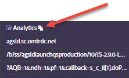

# Informations réseau{#network-information}

Pour afficher les informations réseau, cliquez sur **[!UICONTROL Network]**.

L’écran Réseau regroupe tous les appels de solution Adobe Experience Cloud effectués sur la page et les affiche de façon ordonnée de gauche à droite. Les paramètres standard sont automatiquement étiquetés avec des noms conviviaux et organisés pour regrouper des paramètres communs sur le même rôle.

>[!TIP]
>
>Cet écran est utile pour confirmer que les paramètres utilisés pour les intégrations, tels que l’identifiant visiteur Experience Cloud ou l’ID de données supplémentaire, sont cohérents entre les intégrations.

>[!NOTE]
>
>Actuellement, tous les paramètres transmis dans les appels de solution (par exemple, les variables contextuelles Analytics, les paramètres personnalisés Target ou les ID de client du service Experience Cloud ID) ne sont pas visibles dans l’écran Réseau.

Pour afficher toutes les informations, sélectionnez **[!UICONTROL All]**.

Vous pouvez également filtrer les informations par solution. Sélectionnez les solutions à afficher. Vous pouvez afficher plusieurs solutions simultanément. Les filtres de solution sélectionnés sont mis en surbrillance.

Cliquez sur un élément dans la vue Réseau pour l’agrandir. Vous pouvez copier les informations affichées dans le Presse-papiers à partir de la fenêtre d’affichage agrandie.

Utilisez l’icône en haut de chaque colonne pour copier l’URL d’appel au serveur dans le presse-papiers, dans lequel vous pouvez la coller dans un autre document à des fins de référence ou de débogage.

