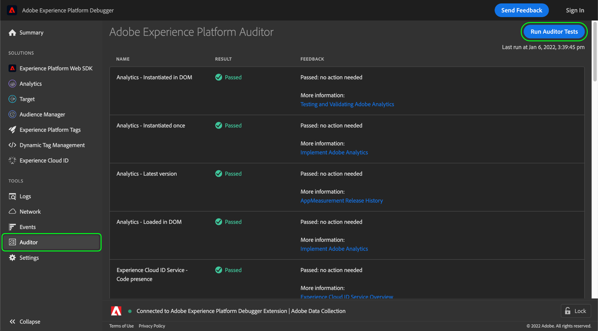

# Auditor

>[!IMPORTANT]
>
>Adobe Experience Platform Debugger est actuellement en version bêta. La documentation et les fonctionnalités peuvent changer.

Dans Adobe Experience Platform Debugger, vous pouvez utiliser la variable **[!UICONTROL Auditor]** pour exécuter une série de tests d’audit sur votre page.

Pour utiliser cette fonctionnalité :

1. Sélectionner **[!UICONTROL Auditor]** dans le volet de navigation de gauche.
1. Sélectionner **[!UICONTROL Run Auditor Tests]**. Une fois les tests terminés, leurs résultats apparaissent ci-dessous.

La liste des résultats contient le test et son résultat, ainsi que des suggestions pour résoudre les problèmes éventuels.
