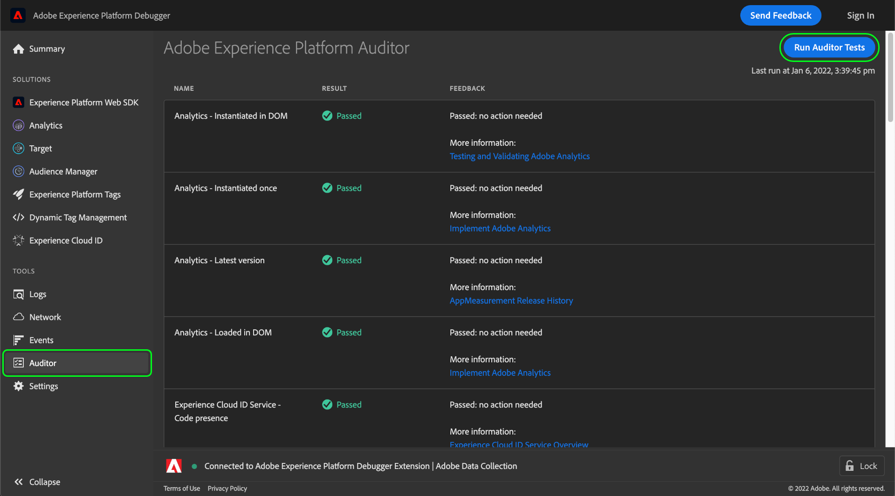

# Onglet Auditeur

Dans Adobe Experience Platform Debugger, vous pouvez utiliser la variable **[!UICONTROL Auditor]** pour exécuter une série de tests d’audit sur votre page.

Pour utiliser cette fonctionnalité :

1. Sélectionnez **[!UICONTROL Auditor]** dans le volet de navigation de gauche.
1. Sélectionnez **[!UICONTROL Run Auditor Tests]**. Une fois les tests terminés, leurs résultats apparaissent ci-dessous.

La liste des résultats contient le test et son résultat, ainsi que des suggestions pour résoudre les problèmes éventuels.

## Interprétation des résultats de test

Chaque test est pondéré et votre score de test est égal au poids attribué. Si vous réussissez un test avec un poids de 5, vous recevez cinq points.

| Score | Description |
| --- | --- |
| 0 | Vous avertit des problèmes que vous devez connaître, mais n’affectez pas votre score. |
| 1 | Recommande une optimisation. Aucune incidence sur la précision des données. |
| 2 | Si ce test échoue, vous n’aurez pas accès aux fonctionnalités et correctifs les plus récents de Adobe Experience Cloud. |
| 3 | Teste l’efficacité et la conformité de l’implémentation aux bonnes pratiques. |
| 4 | Un échec signifie que vous collectez peut-être des données non fiables. |
| 5 | Un échec signifie que vous pouvez subir une perte de données. |

Tous les tests réussissent ou échouent. Ils vérifient la conformité ou la non-conformité aux conditions de test. Il n’existe pas de score partiel pour une conformité partielle. Par exemple, si le test vérifie la version la plus récente d’une solution Adobe et que vous n’avez qu’une version de retard, vous obtenez le même score que si vous aviez cinq versions de retard. Les versions les plus récentes incluent des améliorations de performances et des correctifs de bogues. Il est donc recommandé d’utiliser la version la plus récente.

Il est **vivement recommandé** de corriger les résultats de niveau 4 ou 5.

Il est **recommandé** de corriger les résultats de niveau 1 à 3.

## Technologies d’Adobe prises en charge

La fonction d’audit peut évaluer les technologies d’Adobe suivantes :

* Adobe Advertising Cloud DSP
* Adobe Advertising Cloud Search
* Adobe Analytics
* Adobe Experience Cloud Identity Service
* Adobe Target
* Balises (anciennement Adobe Experience Platform Launch)

## Schémas de test

Pour plus d&#39;informations sur les schémas de test fournis par cette fonctionnalité, consultez les documents suivants :

* [Cohérence des balises](./tag-consistency.md)
* [Présence des balises](./tag-presence.md)
* [Configuration](./configuration.md)
* [Alertes](./alerts.md)
