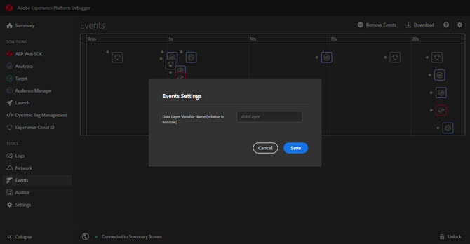

# Onglet Événements

Le **Événements** fournit une vue graphique des événements qui se produisent, affichés sur une chronologie.

Pour chaque événement, l’icône correspondant à la solution concernée apparaît sur la chronologie. Les icônes montrent également les modifications apportées à la couche de données (si l’option est activée). Passez la souris sur une icône pour obtenir un résumé de l’événement. Pour plus d’informations, cliquez sur l’événement . Vous pouvez faire une sélection en maintenant la touche Maj ou Ctrl enfoncée pour afficher plusieurs événements.

Pour plus d’informations, sélectionnez dans le détail.

## Suivi des modifications apportées à la couche de données

Pour activer le suivi des modifications apportées à la couche de données dans la chronologie :

1. Sélectionnez l’icône en forme d’engrenage en haut à droite.
1. Entrez le nom de la couche de données.

   

1. Sélectionner **[!UICONTROL Save]**.

Les détails des modifications apportées à la couche de données indiquent tout élément qui a été supprimé ou ajouté. Vous pouvez sélectionner **{}** pour approfondir l’analyse de la couche de données.

## Téléchargement des informations sur l’événement

Sélectionner **[!UICONTROL Download]** pour télécharger un fichier Excel contenant des informations sur les appels de page.
