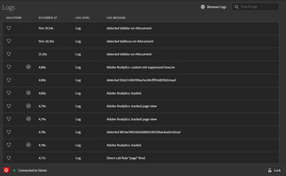

# Journaux {#logs}

>[!IMPORTANT]
>
>Adobe Experience Platform Debugger est actuellement en version bêta. La documentation et les fonctionnalités peuvent changer.

L’écran Journaux fournit des informations spécifiques aux implémentations de DTM, Adobe Experience Platform Launch et du SDK web Adobe Experience Platform. Il n’est pas nécessaire d’activer l’outil de débogage de console pour DTM en vue d’afficher ces informations. Vous pouvez filtrer par solutions mises en œuvre via leurs outils associés.

L’écran Journaux affiche les informations en quatre colonnes :

**[!UICONTROL Solutions] :** affiche les icônes de la solution Experience Cloud affectée par l’élément journalisé. Placez le pointeur sur l’icône pour obtenir une description textuelle.

**[!UICONTROL Occurred at] :** indique le moment où le problème journalisé s’est produit pendant la session.

**[!UICONTROL Log level] :** affiche la gravité du problème. La gravité est l’un des niveaux suivants :

* Journal
* Infos
* Avertissements
* Erreurs

**[!UICONTROL Log message] :** décrit le problème.

Certains messages du journal disposent d’une option Afficher le code. Cliquez sur **[!UICONTROL Show Code]** pour afficher le code conditionnel qui détermine si une règle doit se déclencher.

Pour effacer le journal, cliquez sur **[!UICONTROL Remove Logs]**.
