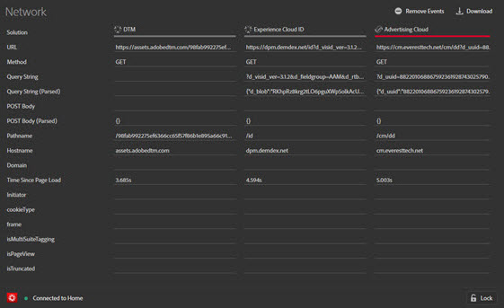

# Réseau {#network}

>[!IMPORTANT]
>
>Adobe Experience Cloud Debugger 2.0 est actuellement en version bêta. La documentation et la fonctionnalité peuvent changer.

Pour afficher les informations réseau, cliquez sur **[!UICONTROL Network]**.

L’écran Réseau regroupe tous les appels de solution Adobe Experience Cloud effectués sur la page et les affiche de façon ordonnée de gauche à droite. Les paramètres standard sont automatiquement étiquetés avec des noms conviviaux et organisés pour regrouper des paramètres communs sur le même rôle.

Cet écran est utile pour comparer des paires clé-valeur entre les accès. Vous pouvez confirmer que les paramètres utilisés pour les intégrations, tels que l’identifiant visiteur Experience Cloud ou l’ID de données supplémentaires, sont cohérents entre les intégrations.

>[!NOTE]
>
>Actuellement, tous les paramètres transmis dans les appels de solution (par exemple, les variables contextuelles Analytics, les paramètres personnalisés Target ou les ID de client du service Experience Cloud ID) ne sont pas visibles dans l’écran Réseau.

Pour modifier les informations par solution, sélectionnez la solution que vous souhaitez afficher depuis la liste dans le volet de navigation de gauche. L’exemple suivant est filtré pour n’afficher qu’Analytics :

Pour revenir à l’affichage de toutes les solutions, cliquez sur **[!UICONTROL Network]**.

Cliquez sur un élément dans la vue Réseau pour consulter un affichage agrandi. Vous pouvez copier les informations affichées dans le Presse-papiers à partir de la fenêtre d’affichage agrandie.

<!--Use the icon at the top of each column to copy the server call URL to your clipboard, where you can paste it into another document for reference or debugging purposes.

-->

Pour effacer la liste, cliquez sur **[!UICONTROL Remove Events]**.

Pour télécharger un fichier Excel contenant les informations de cet écran, cliquez sur **[!UICONTROL Download]**.